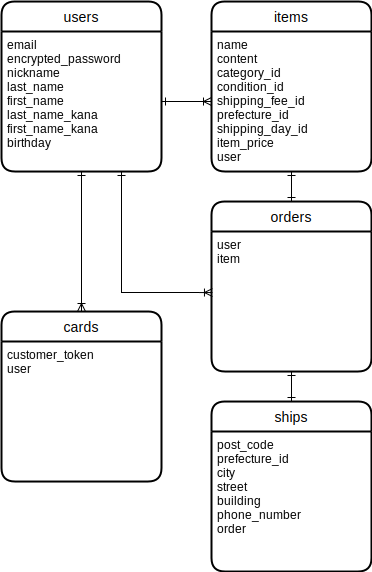

# アプリケーション名
FURIMA

# アプリケーション概要
商品の出品・表示・編集・削除・購入などを行うフリーマーケットアプリ

# URL
http://54.178.203.51/

# 利用方法
## Basic認証
- ユーザー名：admin
- パスワード：1111

## ユーザー
### ユーザー登録
1. トップページのヘッダーから「新規登録」ボタンをクリックする
2. ユーザー情報(ニックネーム・メールアドレス・パスワード・パスワード(確認)・お名前(全角)・お名前カナ(全角)・生年月日)を入力する
3. 「会員登録」ボタンをクリックする

### ユーザーログイン
1. トップページのヘッダーから「ログイン」ボタンをクリックする
2. ログイン情報(メールアドレス・パスワード)を入力する
3.「ログイン」ボタンをクリックする

### ユーザーログアウト
1. トップページのヘッダーから「ログアウト」ボタンをクリックする

## マイページ
### マイページへのアクセス
1. トップページのヘッダーからニックネームをクリックする

### 基本情報の更新
1. トップページのヘッダーからニックネームをクリックする
2. 「基本情報」の右側にある「更新」ボタンをクリックする
3. 更新内容を入力する
4. 「現在のパスワード」を入力する
5. 「更新」ボタンをクリックする

### クレジットカード情報の更新
1. トップページのヘッダーからニックネームをクリックする
2. 「クレジットカード情報」の右側にある「更新」ボタンをクリックする
3. クレジットカード情報を入力する
4. 「登録」ボタンをクリックする

### クレジットカード情報の削除
1. トップページのヘッダーからニックネームをクリックする
2. 「クレジットカード情報」の右側にある「削除」ボタンをクリックする

## 出品
### 新規商品の出品
1. トップページの右下にある「出品」ボタンをクリックする
2. 商品情報(商品画像・商品名・商品の説明・カテゴリー・商品の状態・配送料の負担・発送元の地域・発送までの日数・販売価格)を入力する
3. 「出品する」ボタンをクリックする

### 既存商品の編集
1. トップページから自身が出品した商品を選択する
2. 「商品の編集」ボタンをクリックする
3. 編集内容を入力する
4. 「変更する」ボタンをクリックする

### 既存商品の削除
1. トップページから自身が出品した商品を選択する
2. 「削除」ボタンをクリックする

## 商品購入
### 商品の購入
1. トップページから他ユーザーが出品した商品を選択する
2. 「購入画面に進む」ボタンをクリックする
3. 「購入内容の確認」が表示された場合、4.へ 
　　「クレジットカード情報の更新」を参照し、クレジットカードを登録する
4. 配送情報(郵便番号・都道府県・市区町村・番地・建物名・電話番号)を入力する
5. 「購入」ボタンをクリックする

# 追加実装した機能について
## プレビュー機能
### 商品出品前に画像が表示されること

### 既存商品の編集時に差し替えた画像が表示されること

## エラーメッセージの日本語化

## マイページ
### マイページの表示

### ユーザー情報更新機能

### 出品済み商品表示機能
(https://gyazo.com/ccf1ab1d135c2fd74c954d4378ec0caf)

## クレジットカード登録機能
### クレジットカード登録

### クレジットカード削除

### 登録済みカードでの商品購入

## もどるボタン
### 固定ページではなく、1つ前のページに戻るように修正

# データベース設計
## ER図

## テーブル
## usersテーブル

| Column                | Type       | Options                        |
| --------------------- | ---------- | ------------------------------ |
| email                 | string     | null: false, unique: true      |
| encrypted_password    | string     | null: false                    |
| nickname              | string     | null: false                    |
| last_name             | string     | null: false                    |
| first_name            | string     | null: false                    |
| last_name_kana        | string     | null: false                    |
| first_name_kana       | string     | null: false                    |
| birthday              | date       | null: false                    |

### Association
- has_many :items
- has_many :orders

## itemsテーブル

| Column                | Type       | Options                        |
| --------------------- | ---------- | ------------------------------ |
| name                  | string     | null: false                    |
| content               | text       | null: false                    |
| category_id           | integer    | null: false                    |
| condition_id          | integer    | null: false                    |
| shipping_fee_id       | integer    | null: false                    |
| prefecture_id         | integer    | null: false                    |
| shipping_day_id       | integer    | null: false                    |
| item_price            | integer    | null: false                    |
| user                  | references | null: false, foreign_key: true |

### Association
- belongs_to :user
- has_one :order

## ordersテーブル

| Column                | Type       | Options                        |
| --------------------- | ---------- | ------------------------------ |
| user                  | references | null: false, foreign_key: true |
| item                  | references | null: false, foreign_key: true |

### Association
- belongs_to :user
- belongs_to :item
- has_one :ship

## shipsテーブル

| Column                | Type       | Options                        |
| --------------------- | ---------- | ------------------------------ |
| post_code             | string     | null: false                    |
| prefecture_id         | integer    | null: false                    |
| city                  | string     | null: false                    |
| street                | string     | null: false                    |
| building              | string     |                                |
| phone_number          | string     | null: false                    |
| order                 | references | null: false, foreign_key: true |

### Association
- belongs_to :order

## cardsテーブル

| Column                | Type       | Options                        |
| --------------------- | ---------- | ------------------------------ |
| customer_token        | string     | null: false                    |
| user                  | references | null: false, foreign_key: true |

### Association
- belongs_to :user

# 開発環境
- フロントエンド
- バックエンド
- インフラ
- テスト
- テキストエディタ
- タスク管理

# ローカルでの動作方法
以下のコマンドをターミナルで順に実行。 
% git clone https://github.com/likapantrip/furima-41468.git 
% cd furima-41468 
% bundle install 
% rails db:create 
% rails db:migrate 
% rails s

# 追加実装で工夫したポイント
- プレビュー機能で表示される画像の大きさをCSSで固定したこと
- エラーメッセージの日本語を項目名に合わせたこと
- 自身のマイページ以外は、個人情報が表示されないようにしたこと
- ユーザー情報を更新できるようにしたこと
- 登録できるクレジットカード情報は1つのみにしたこと
- クレジットカード情報を削除できること
- ユーザーを削除すると、紐づいているクレジットカード情報が削除されること
- クレジットカードが登録されていない場合は、購入画面に進めないこと
- 「もどる」ボタンを部分テンプレートで実装したこと